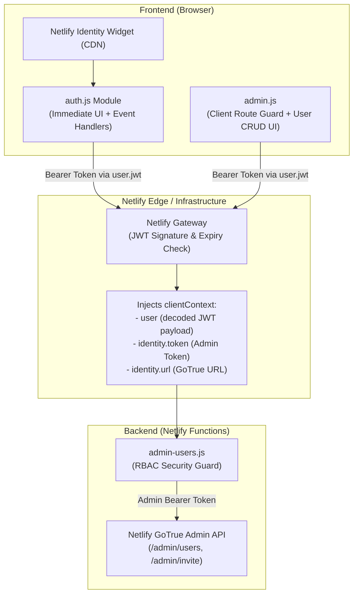

# Netlify Identity Authentication & RBAC Setup Guide

This document provides a comprehensive, step-by-step blueprint for setting up **Netlify Identity Authentication** with **Role-Based Access Control (RBAC)** and **GoTrue Admin API** integration in a vanilla HTML/JS web application.

---

## 1. Architectural Overview

The authentication architecture consists of three main layers:



### Key Architectural Principles
1. **Zero Frontend Build Step:** Frontend loads the official `netlify-identity-widget` via CDN.
2. **Resilient UI Rendering:** Auth UI renders a default state immediately without waiting for third-party scripts, avoiding layout shift or blocked execution if CDN is slow.
3. **Pure Server-Enforced RBAC:** Client checks (`app_metadata.roles.includes('admin')`) are strictly for UX (showing admin buttons, preventing UI flicker). The serverless function (`admin-users.js`) is the authoritative security boundary.
4. **Internal Admin Token:** Serverless functions receive an internal, short-lived GoTrue admin token (`context.clientContext.identity.token`) directly from Netlify's runtime to manage users. This token is never exposed to the client.

---

## 2. Step 1: Netlify Dashboard Configuration

To enable and configure Netlify Identity for your site:

### 1. Enable Identity
1. Log in to [Netlify](https://app.netlify.com/).
2. Select your site.
3. Navigate to **Site configuration** (or **Site settings**) → **Identity**.
4. Click **Enable Identity**.

### 2. Configure Registration Preferences
1. Under **Identity** → **Registration preferences**:
   - Set **Registration** to **Invite only** (prevents public signups; only administrators can invite users).
   - If public signups are desired, set to **Open**.

### 3. Configure Email Notifications & Templates
1. Under **Identity** → **Emails**:
   - Customize email templates (Invitation, Confirmation, Password Recovery, Email Change) if needed.
   - Configure external SMTP provider if high email deliverability is required.

### 4. Assign Roles to Users
Roles are stored in the user's `app_metadata.roles` array (which can only be edited by admins or backend functions, never by the user themselves).
1. Go to **Identity** tab in the Netlify Dashboard.
2. Click on a registered user.
3. Click **Edit User** / **Edit roles**.
4. Add `admin` to the roles list and save.

---

## 3. Step 2: HTML & CSS Setup

### 1. Include CDN Script in HTML Head
Include the Netlify Identity widget script in the `<head>` of any page that requires authentication:

```html
<!-- Netlify Identity Widget -->
<script src="https://identity.netlify.com/v1/netlify-identity-widget.js"></script>
```

### 2. Provide Auth Mount Point in Header
Add a container element where the auth button / avatar dropdown will be mounted:

```html
<header class="app-header">
  <h1 class="brand-title">My App</h1>
  <div class="theme-controls">
    <!-- Injected by auth.js -->
    <div id="auth-control" class="auth-control"></div>
  </div>
</header>
```

### 3. Styling (`css/auth.css`)
Key UI components needed:
- `.auth-signin-btn`: Pill-style button with login icon.
- `.auth-avatar-btn`: Circular button showing user initials (e.g. `KW`).
- `.auth-menu`: Floating dropdown menu anchored to the avatar with user email, role-gated navigation links (e.g. `/admin`), and a Sign Out button.

---

## 4. Step 3: Client-Side Auth Module (`js/modules/auth.js`)

The client module handles rendering, dropdown menus, and Netlify Identity widget event hooks.

```javascript
/**
 * js/modules/auth.js — Client-side Netlify Identity integration
 */

export function initAuth() {
  const control = document.getElementById('auth-control');
  if (!control) return;

  // ── Helpers ────────────────────────────────────────────────────────────

  function getInitials(email = '') {
    return email.slice(0, 2).toUpperCase();
  }

  function isAdminUser(user) {
    // app_metadata is server-managed and read-only from the client.
    return (user?.app_metadata?.roles ?? []).includes('admin');
  }

  // ── UI Builders ────────────────────────────────────────────────────────

  function buildSignInBtn() {
    return `
      <button id="auth-signin-btn" class="btn auth-signin-btn" aria-label="Sign in">
        <svg width="16" height="16" viewBox="0 0 24 24" fill="none"
             stroke="currentColor" stroke-width="2" stroke-linecap="round" stroke-linejoin="round"
             aria-hidden="true">
          <path d="M20 21v-2a4 4 0 0 0-4-4H8a4 4 0 0 0-4 4v2"/>
          <circle cx="12" cy="7" r="4"/>
        </svg>
        Sign In
      </button>`;
  }

  function buildAvatar(user) {
    const initials = getInitials(user.email);
    const admin    = isAdminUser(user);
    return `
      <div class="auth-avatar-wrap" id="auth-avatar-wrap">
        <button
          class="auth-avatar-btn"
          id="auth-avatar-btn"
          aria-haspopup="true"
          aria-expanded="false"
          aria-label="Account menu"
          title="${user.email}"
        >
          <span class="auth-avatar" aria-hidden="true">${initials}</span>
        </button>
        <div class="auth-menu" id="auth-menu" hidden role="menu" aria-label="Account options">
          <span class="auth-menu-email">${user.email}</span>
          ${admin
            ? `<a href="/admin" class="auth-menu-item" role="menuitem">User Management</a>`
            : ''}
          <button class="auth-menu-item auth-signout-btn" id="auth-signout-btn" role="menuitem">
            Sign Out
          </button>
        </div>
      </div>`;
  }

  // ── Event Binding ──────────────────────────────────────────────────────

  function bindEvents(user) {
    if (!user) {
      document.getElementById('auth-signin-btn')?.addEventListener('click', () => {
        window.netlifyIdentity?.open();
      });
      return;
    }

    const avatarBtn = document.getElementById('auth-avatar-btn');
    const menu      = document.getElementById('auth-menu');

    // Toggle dropdown
    avatarBtn?.addEventListener('click', (e) => {
      e.stopPropagation();
      const isOpen = !menu.hidden;
      menu.hidden  = isOpen;
      avatarBtn.setAttribute('aria-expanded', String(!isOpen));
    });

    // Close on outside click
    document.addEventListener('click', (e) => {
      const wrap = document.getElementById('auth-avatar-wrap');
      if (menu && !menu.hidden && !wrap?.contains(e.target)) {
        menu.hidden = true;
        avatarBtn?.setAttribute('aria-expanded', 'false');
      }
    });

    // Close on Escape key
    document.addEventListener('keydown', (e) => {
      if (e.key === 'Escape' && menu && !menu.hidden) {
        menu.hidden = true;
        avatarBtn?.setAttribute('aria-expanded', 'false');
        avatarBtn?.focus();
      }
    });

    // Sign out action
    document.getElementById('auth-signout-btn')?.addEventListener('click', () => {
      window.netlifyIdentity?.logout();
    });
  }

  // ── Render ─────────────────────────────────────────────────────────────

  function render(user) {
    control.innerHTML = user ? buildAvatar(user) : buildSignInBtn();
    bindEvents(user);
  }

  // Step 1: Render default (Sign In) immediately so UI doesn't pop or wait for network
  render(null);

  // Step 2: Hook into Netlify Identity widget
  const ni = window.netlifyIdentity;
  if (!ni) return;

  ni.on('login', (user) => {
    ni.close();
    render(user);
  });

  ni.on('logout', () => {
    render(null);
    if (window.location.pathname.startsWith('/admin')) {
      window.location.href = '/';
    }
  });

  ni.on('error', (err) => console.error('[auth] Netlify Identity error:', err));

  // Step 3: Check current user session on load
  const currentUser = ni.currentUser?.();
  if (currentUser) {
    render(currentUser);
  }
}
```

---

## 5. Step 4: Routing & Clean URLs (`netlify.toml`)

Configure serverless function paths and clean rewrite rules in `netlify.toml`:

```toml
[build]
  publish = "."
  functions = "netlify/functions"

# Clean URL route for /admin -> /admin.html
[[redirects]]
  from = "/admin"
  to   = "/admin.html"
  status = 200

# SPA fallback
[[redirects]]
  from = "/*"
  to = "/index.html"
  status = 200
```

---

## 6. Step 5: Admin Page & Client Route Guard (`js/admin.js`)

On protected pages (e.g. `admin.html`), check authorization before displaying content, and attach the user's JWT to API requests.

### Client-Side Guard
```javascript
import { initAuth } from './modules/auth.js';

function isAdminUser(user) {
  return (user?.app_metadata?.roles ?? []).includes('admin');
}

document.addEventListener('DOMContentLoaded', async () => {
  const user = window.netlifyIdentity?.currentUser?.();

  // Guard check: redirect non-admin users to home
  if (!user || !isAdminUser(user)) {
    window.location.replace('/');
    return;
  }

  // Reveal protected DOM and load data
  document.getElementById('admin-loading').hidden = true;
  document.getElementById('admin-content').hidden = false;

  initAuth();
  await loadAdminData();
});
```

### Making Authenticated API Calls with Auto-Refreshing JWTs
> [!IMPORTANT]
> **Always call `await user.jwt()`** before an API call instead of storing a token string in a variable. `user.jwt()` automatically checks expiration and refreshes the token against GoTrue if it is expired or near expiry.

```javascript
async function apiFetch(endpoint, options = {}) {
  const user = window.netlifyIdentity?.currentUser?.();
  const token = user ? await user.jwt() : null;

  const res = await fetch(endpoint, {
    ...options,
    headers: {
      'Content-Type': 'application/json',
      ...(token ? { Authorization: `Bearer ${token}` } : {}),
      ...(options.headers ?? {}),
    },
  });

  if (!res.ok) {
    const errorBody = await res.json().catch(() => ({ error: `HTTP ${res.status}` }));
    throw new Error(errorBody.error ?? `HTTP ${res.status}`);
  }

  if (options.method === 'DELETE') return null;
  return res.json();
}
```

---

## 7. Step 6: Serverless Admin Functions & GoTrue API (`netlify/functions/admin-users.js`)

When a client sends an `Authorization: Bearer <JWT>` header to a Netlify serverless function, Netlify verifies the token signature and populates `context.clientContext`:

- `context.clientContext.user`: Decoded user object containing `email`, `sub`, and `app_metadata.roles`.
- `context.clientContext.identity.token`: Internal short-lived admin bearer token for GoTrue.
- `context.clientContext.identity.url`: Base URL for the site's GoTrue instance.

### Implementation: `netlify/functions/admin-users.js`

```javascript
/**
 * admin-users.js — Netlify Function
 *
 * Exposes admin CRUD operations for Netlify Identity users via the GoTrue Admin API.
 * Protected by server-side RBAC: only callers with the 'admin' role in app_metadata are allowed.
 */

// ── 1. Authorization check ────────────────────────────────────────────────
function isAdmin(clientContext) {
  const user = clientContext?.user;
  if (!user) return false;
  const roles = user.app_metadata?.roles ?? [];
  return roles.includes('admin');
}

// ── 2. GoTrue HTTP helper ─────────────────────────────────────────────────
async function gotrueRequest(url, method, body, adminToken) {
  const res = await fetch(url, {
    method,
    headers: {
      Authorization: `Bearer ${adminToken}`,
      'Content-Type': 'application/json',
    },
    body: body ? JSON.stringify(body) : undefined,
  });

  if (!res.ok) {
    const text = await res.text().catch(() => '(no body)');
    throw new Error(`GoTrue ${method} ${url} → ${res.status}: ${text}`);
  }

  return method === 'DELETE' ? null : res.json();
}

function json(statusCode, data) {
  return {
    statusCode,
    headers: { 'Content-Type': 'application/json' },
    body: JSON.stringify(data),
  };
}

// ── 3. Handler ────────────────────────────────────────────────────────────
exports.handler = async (event, context) => {
  const { clientContext } = context;

  // Enforce Admin RBAC
  if (!isAdmin(clientContext)) {
    return json(403, { error: 'Forbidden: Admin access required' });
  }

  const adminToken = clientContext?.identity?.token;
  const identityUrl = (clientContext?.identity?.url ?? '').replace(/\/$/, '');

  if (!adminToken || !identityUrl) {
    return json(500, { error: 'Identity runtime context unavailable' });
  }

  const usersUrl = `${identityUrl}/admin/users`;

  try {
    // GET: List all registered users
    if (event.httpMethod === 'GET') {
      const data = await gotrueRequest(usersUrl, 'GET', undefined, adminToken);
      return json(200, data.users ?? []);
    }

    // POST: Send an email invitation to a new user
    if (event.httpMethod === 'POST') {
      const { action, email } = JSON.parse(event.body || '{}');
      if (action !== 'invite' || !email) {
        return json(400, { error: 'Invalid payload — expected { action: "invite", email }' });
      }

      const invited = await gotrueRequest(
        `${identityUrl}/admin/invite`,
        'POST',
        { email },
        adminToken
      );
      return json(200, { ok: true, user: invited });
    }

    // DELETE: Delete a user by ID
    if (event.httpMethod === 'DELETE') {
      const userId = event.queryStringParameters?.id;
      if (!userId) {
        return json(400, { error: 'Missing query parameter: id' });
      }

      await gotrueRequest(`${usersUrl}/${userId}`, 'DELETE', undefined, adminToken);
      return json(200, { ok: true });
    }

    return json(405, { error: 'Method Not Allowed' });
  } catch (err) {
    console.error('[admin-users] Error:', err.message);
    return json(500, { error: err.message });
  }
};
```

---

## 8. Local Development & Testing Workflow

### Running Locally with `netlify dev`
Because serverless functions depend on `clientContext.identity` injected by Netlify, you must link your local project to your Netlify site:

1. Install Netlify CLI:
   ```bash
   npm install -g netlify-cli
   ```
2. Link local repo to your remote site:
   ```bash
   netlify link
   ```
3. Start the dev server:
   ```bash
   netlify dev
   ```
   `netlify dev` automatically intercepts functions and passes the live Identity context for authenticated users.

---

## 9. Best Practices & Common Gotchas

| Scenario / Issue | Cause | Solution |
| :--- | :--- | :--- |
| **Token Expiry (1 hour)** | Netlify JWTs expire after 60 minutes. | Always call `await user.jwt()` immediately before network requests rather than caching the token string. |
| **Role Update Lag** | If you edit a user's roles in the Netlify Dashboard, their existing JWT token in local storage will still contain the old roles. | The user must re-login or call `window.netlifyIdentity.refresh()` / `user.jwt(true)` to receive an updated JWT. |
| **Module Script Timing** | ES modules are deferred by default, meaning `DOMContentLoaded` fires before the module executes. | Do not wait for a custom `init` event if `window.netlifyIdentity.currentUser()` already exists on module startup. Call `currentUser()` synchronously at start. |
| **Admin Token Exposure** | Exposing `clientContext.identity.token` to the client gives full administrative control over all user accounts. | **Never return `identity.token` in function responses or console log it on the client.** |
| **Identity Event Triggers** | Trigger functions like `identity-signup.js` or `identity-validate.js` cannot be fully simulated locally by `netlify dev`. | Test signup hooks by deploying to a live Netlify preview branch. |
